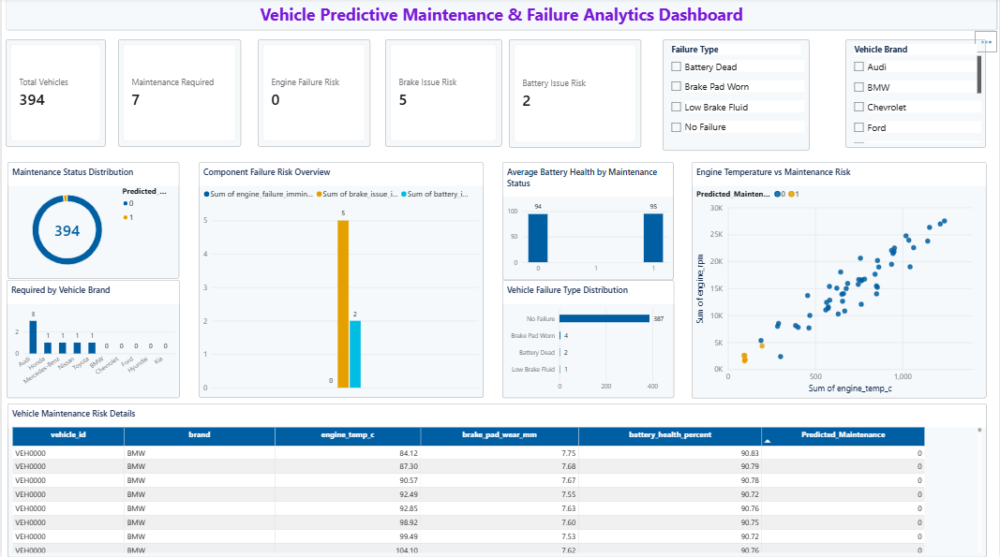

# Predictive Maintenance for Vehicles

A machine learning and analytics project designed to predict potential vehicle maintenance requirements using telemetry and sensor data. The project analyzes engine, brake, and battery conditions and presents the results through an interactive Power BI dashboard.

## Project Objective

The objective of this project is to identify vehicles that may require maintenance before a potential failure occurs.

The project focuses on:

- Analyzing vehicle telemetry and sensor data
- Identifying engine, brake, and battery failure patterns
- Predicting whether maintenance is required
- Comparing multiple machine learning models
- Visualizing maintenance and failure insights using Power BI

## Dataset

The project uses the **Vehicle Maintenance Telemetry Data** dataset.

The dataset contains vehicle telemetry information such as:

- Engine temperature and RPM
- Oil pressure
- Coolant temperature
- Engine vibration
- Brake fluid level
- Brake pad wear
- Brake temperature
- Battery voltage and temperature
- Battery charge and health
- Vehicle speed
- Odometer reading
- Engine, brake, and battery failure indicators

The dataset is synthetic and is used to simulate vehicle telemetry and maintenance conditions.

## Project Workflow

1. Data Understanding
2. Data Cleaning
3. Exploratory Data Analysis
4. Engine Failure Analysis
5. Brake Issue Analysis
6. Battery & Sensor Analysis
7. Data Preprocessing
8. Feature Selection & Train-Test Split
9. Machine Learning Model Building
10. Model Comparison & Best Model Selection
11. Best Model Evaluation
12. Final Prediction & Export
13. Power BI Dashboard Development

## Machine Learning Models

Three classification models were developed and compared:

- Logistic Regression
- Decision Tree Classifier
- Random Forest Classifier

The models were evaluated using:

- Accuracy
- Precision
- Recall
- F1 Score
- Classification Report
- Confusion Matrix

The best-performing model was selected based on the **F1 Score**.

## Maintenance Target

A single target called `maintenance_required` was created using the available failure indicators.

A vehicle is classified as requiring maintenance when at least one of the following conditions is present:

- Engine failure imminent
- Brake issue imminent
- Battery issue imminent

This provides a simple business-focused maintenance prediction target.

## Power BI Dashboard

The Power BI dashboard provides an interactive view of vehicle health and maintenance risk.

Dashboard components include:

- Total Vehicle Records
- Maintenance Required
- Engine Failure Risk
- Brake Issue Risk
- Battery Issue Risk
- Maintenance Status Distribution
- Maintenance Required by Vehicle Brand
- Vehicle Failure Type Distribution
- Component Failure Risk Overview
- Engine Temperature vs Maintenance Risk
- Average Battery Health by Maintenance Status
- Vehicle Maintenance Risk Details
- Vehicle Brand and Failure Type filters

## Dashboard Preview

## Tools & Technologies

- Python
- Pandas
- NumPy
- Matplotlib
- Seaborn
- Scikit-learn
- Jupyter Notebook
- Power BI
- GitHub

## Key Business Value

This project demonstrates how vehicle telemetry data can be transformed into maintenance insights using machine learning.

Predictive maintenance analytics can help organizations identify vehicles requiring attention, monitor component-level risks, and support proactive maintenance decisions.

## Limitations

- The dataset is synthetic and does not represent live production vehicle telemetry.
- The model is developed as a batch machine learning prototype rather than a real-time IoT deployment.
- Model performance depends on the patterns available in the synthetic dataset.
- Further validation using real-world vehicle maintenance data would be required before production deployment.

## Author

**Ajai M**

Aspiring Data Analyst | Python | SQL | Excel | Power BI | Machine Learning
